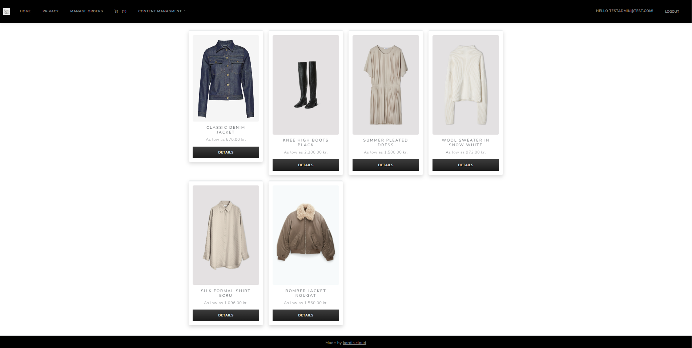
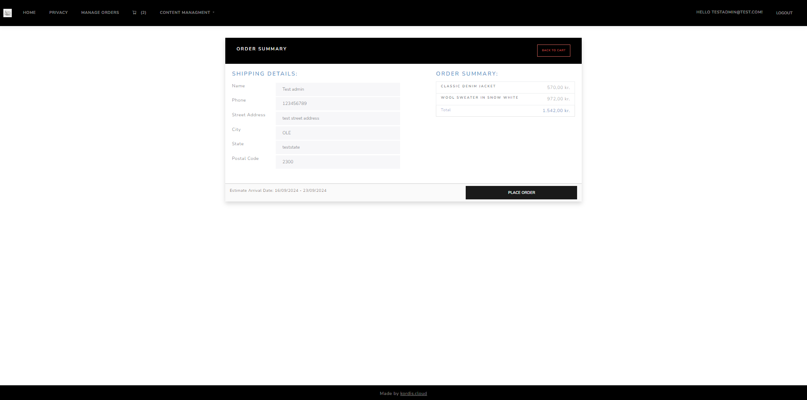
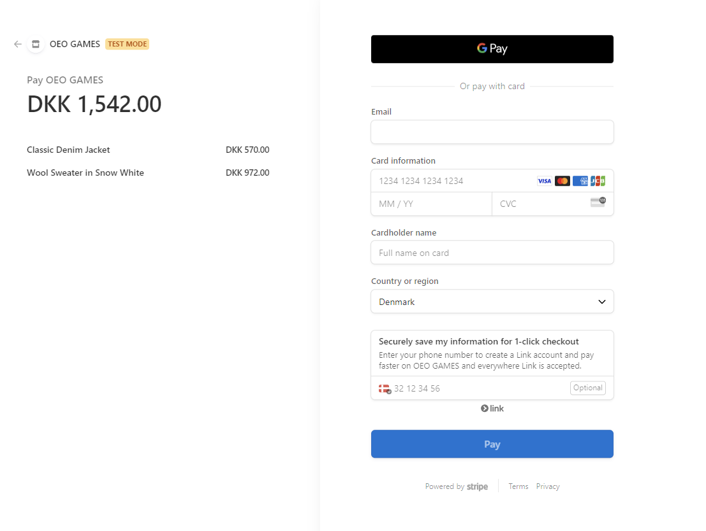
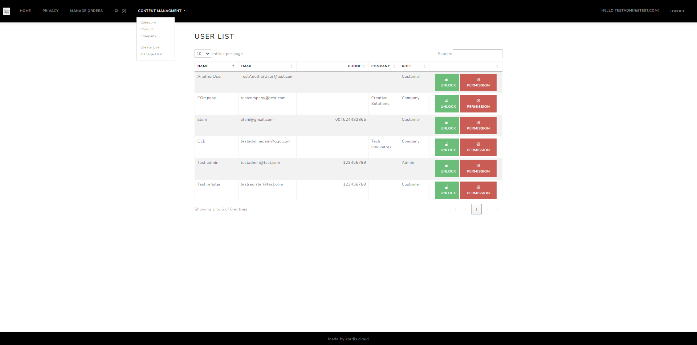

# EShop 

## Overview
EShop is a full-fledged web application built using ASP.NET Core Razor Pages, Entity Framework, and SQL Server. It supports multiple user roles (Admin, Employee, Customer, and Company), and allows product browsing, order management, and role-based permissions.

<p align="center">
  
  
  
  
</p>

Live Project: [EShop on Azure](https://eshop-dotnet-hwg4hacyc7bcaga6.northeurope-01.azurewebsites.net/)

This project follows modern architectural patterns such as the Repository Pattern and Domain-Driven Design (DDD) to ensure scalability, clean code, and reusability.
## Features
- **User Management**
  - Admins and Employees can manage user accounts (lock/unlock, assign roles, etc.).
  - Customers can browse products, manage their accounts, and place orders.
  
- **Order Management**
  - Admins and Employees can update order statuses, manage orders, and process refunds.
  
- **Role-Based Access Control**
  - Different access levels for Admins, Employees, Customers, and Company accounts.
  
- **Shopping Cart & Payment Integration**
  - Add/remove items to/from the cart.
  - Integrated with Stripe for secure payments.

## Installation
1. Clone the repository.
   ```bash
   git clone https://github.com/your-repo/eshop-dotnet.git
   ```
2. Navigate to the project directory.
   ```bash
   cd eshop-dotnet
   ```
3. Set up the environment (connection strings, API keys, etc.).
4. Build and run the application. 
   ```bash
   dotnet build
   dotnet run
   ```

## Roles & Permissions

| **Role**     | **Permissions**                                         |
| ------------ | ------------------------------------------------------- |
| **Admin**    | Full access to user and order management.               |
| **Employee** | Manage orders and assist with customer support.         |
| **Customer** | Browse products, manage cart, and place orders.         |
| **Company**  | Special pricing.               |

## Technology Stack

- **Backend**: .NET Core, ASP.NET MVC, Entity Framework  
- **Frontend**: Razor Views, Bootstrap, jQuery  
- **Database**: SQL Server  
- **Payment**: Stripe Integration  

## Architecture

- **Repository Pattern**: Ensures separation of concerns by isolating business logic from data access.
- **Domain-Driven Design (DDD)**: Helps manage complex business rules by organizing code around business domains.
- **Entity Framework Core (Code-First)**: Manages database migrations and schema updates.
- **Authentication & Authorization**: ASP.NET Identity for secure user authentication, with multi-role support.